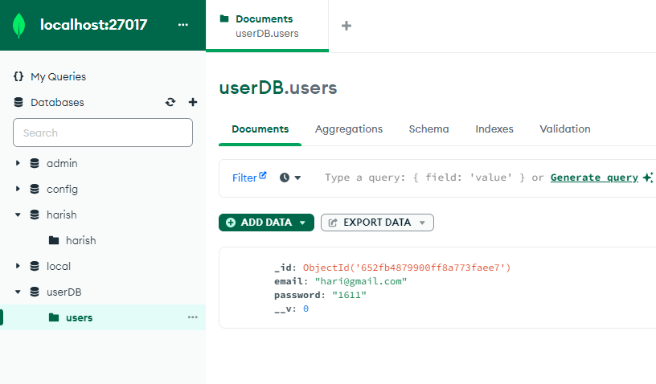
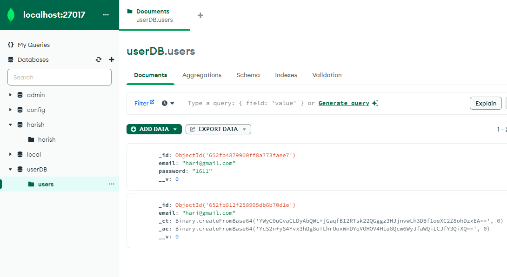
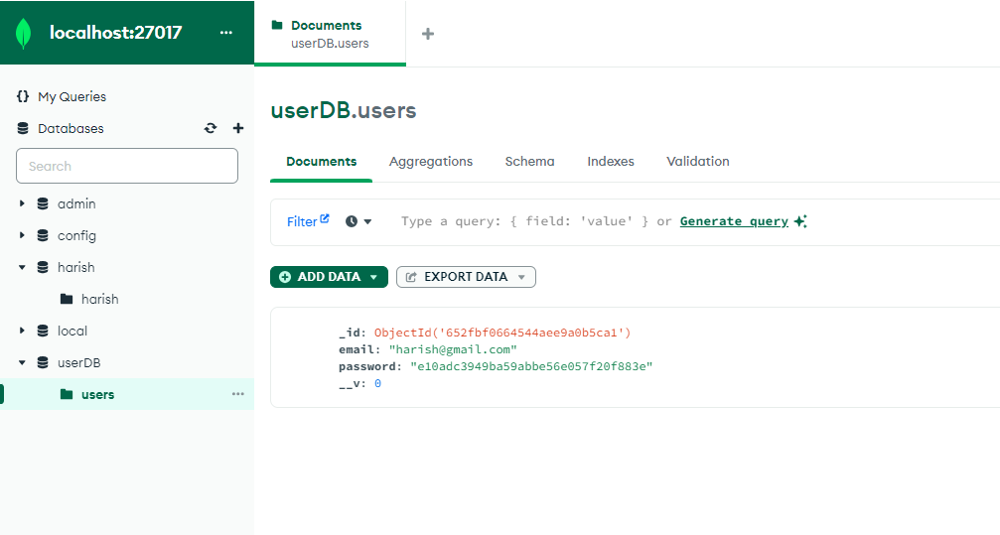

# Authentication-Security

Authentication & Security Repo: It is created to describe and practice different levels of Auth & Security.( Go through the Git Commit sequence to understand different levels)

## Tools & Technologies

- NodeJS
- ExpressJS
- EJS
- MongoDB

## Level-1: Basic ( Username & Password)

In Level-1 Auth & Security, Username & Password are used for user Authentication process. It is the least secure approach.

As we can see, user credentials direclty stored in the DB with out any security.

## Level-2: Encryption

In Level-2 Auth & Security, the password is encrypted using mongoose-encryption and stored as the encrypted password in the DB. During login, it is automatically decrypted and the user is authenticated. This method provides better security than Level-1.

## Level-3: Hashing with md5

In Level-3 Auth & Security, the password is scrambled using Hash techniques, unlike encryption techniques. Once the password is scrambled, we cannot unscramble it back. Here, it takes the user-entered password during login, hashes it, and compares it with the stored hashed password to authenticate. Practically, this approach is better than Level-2, but it has its own demerits.

